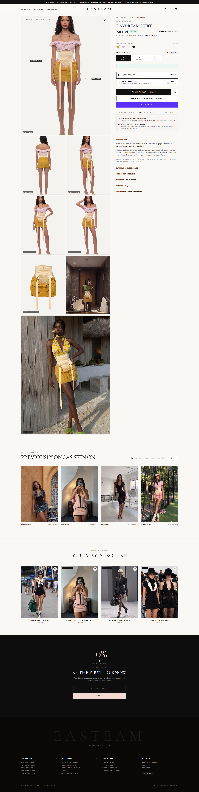
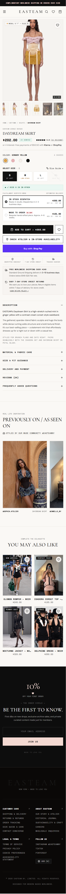

# EASTEAM — Daydream Skirt Redesign

An editorial luxury product detail page (PDP) experience designed and built for **EASTEAM**, capturing the brand's quiet luxury NYC atelier aesthetic.

---

## What We Changed

The original [EASTEAM Daydream Skirt page](https://easteamny.com/products/daydream-skirt) had several friction points for shoppers: stock availability versus made-to-order timelines were ambiguous, garment sizing and model dimensions required guessing or navigating away, shipping thresholds and return policies lacked upfront clarity, and the mobile browsing experience lacked smooth touch navigation and a sticky conversion bar.

We reimagined the page into an elevated, high-conversion editorial experience where shoppers get complete information without ever leaving the page:
- **Transparent Dual Fulfillment**: Seamless switching between **In-Stock Studio Dispatch** (dispatched within 48h) and **Made to Order** (5% bespoke discount, handcrafted in 4–6 weeks).
- **Instant Stock & Sizing Clarity**: Real-time stock cues per size and color swatch, interactive model measurement callouts on garment imagery, metric/imperial size guide modal, and a boutique atelier stock locator.
- **Upfront Shipping & Returns**: Dynamic free shipping progress tracker ($149 threshold) inside an interactive slide-out cart drawer, paired with instant on-page return policy access.
- **Responsive Editorial Experience**: Clean two-column desktop gallery with fullscreen lightbox zoom, paired with a touch-friendly swipe carousel and sticky bottom conversion bar on mobile.

---

## Previews

### Laptop View


### Mobile View
<p align="center">
  
</p>

---

## Setup & Build Guide

### Prerequisites
- [Node.js](https://nodejs.org/) (v18 or higher recommended)
- npm (or yarn / pnpm)

### Setup & Development
```bash
# Install dependencies
npm install

# Start local development server
npm run dev
```
Open [http://localhost:5173](http://localhost:5173) to view the application.

### Build Commands
```bash
# Build for production
npm run build

# Preview production build locally
npm run preview
```
